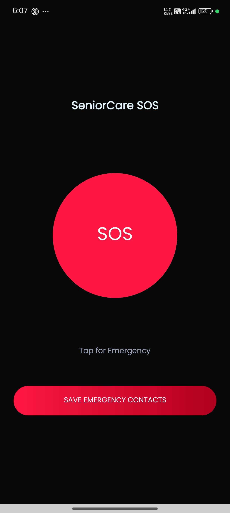

# SeniorCare SOS App

An Android application designed to provide emergency assistance for senior citizens.

## 🚀 Features
- One-tap SOS button
- Sends SMS with live location
- Emergency call feature

## 🛠️ Tech Stack
- Java
- XML
- Android Studio

## 📱 Project Structure
- app/src → Main source code

- ## 📸 Screenshots

### Home Screen

### SOS Button

## 👨‍💻 Author
Dhananjeyean
